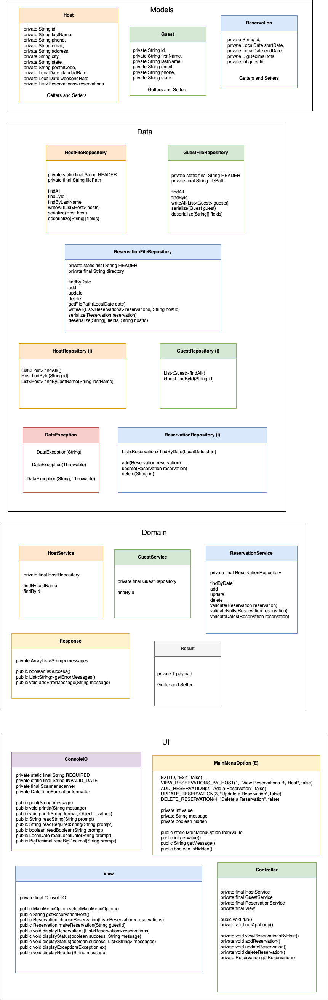

# Project Schedule

## Day 1: Planning and Project Structure

### Assessment 4 revisions
- **Time:** 2 hours

### Project Planning
- Define project scope and requirements (1 hour)

### Create Class Diagrams
- Design class diagrams for Reservation, Guest, and Host models (2 hours)
- Design class diagrams for repositories and services (2 hours)

## Day 2: Project Setup and Model Creation

### Project Setup
- Set up Spring Boot project and dependencies (2 hours)
- Initialize Git repository (1 hour)

### Create Domain Models
- Create Reservation model (1 hour)
- Create Guest model (1 hour)
- Create Host model (1 hour)

## Day 3: Data Access Layer

### Create Repositories
- ReservationRepository for accessing reservation data (2 hours)
- GuestRepository for accessing guest data (1 hour)
- HostRepository for accessing host data (1 hour)

### Testing Repositories
- Write unit tests for ReservationRepository, GuestRepository, and HostRepository (2 hours)

## Day 4: Domain Layer

### Create Services
- ReservationService with methods to view, create, edit, and cancel reservations (3 hours)
- GuestService for managing guest-related operations (1 hour)
- HostService for managing host-related operations (1 hour)

### Testing Services
- Write unit tests for ReservationService, GuestService, and HostService (3 hours)

## Day 5: UI Layer

### Create Controller
- Controller with methods for viewing, creating, editing, and canceling reservations (4 hours)

### Create Console and View
- Create console interface and View with methods for displaying menus and handling user input for each operation (4 hours)

## Day 6-7: Final Touches

### Bug Fixes and Enhancements
- Address any bugs found (3+ hours)

## Class Diagrams

